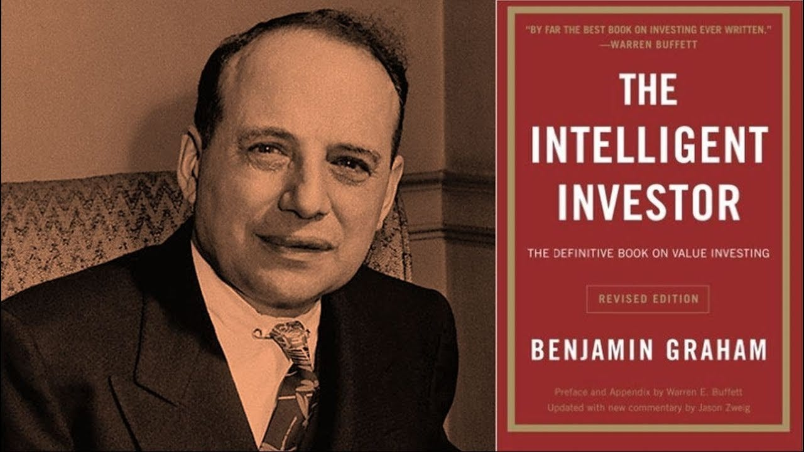

# VALUE INVESTOR SUITE

    

Welcome to the Value Investor Suite (VIS)
_____________
As the name of the repository suggests, this suite has been thought, designed and developed to use the tools revealed by Dr. [Benjamin Graham](https://en.wikipedia.org/wiki/Benjamin_Graham) with his ["value investing"](https://en.wikipedia.org/wiki/Value_investing) theory. Indeed, he changed the perspective of investments, suggesting a more analytical approach, thanks to which studying every stock starting from its fundamentals. He wanted every investor to define his/her financial decisions after having proved the value of a certain stock, given by its historical data. Benjamin Graham is also known to be the mentor of Warren Buffett, who indeed started his financial career working at Graham's dependencies.

    
     
    Benjamin Graham and the book <a href="https://en.wikipedia.org/wiki/The_Intelligent_Investor" target="_blank">"The Intelligent Investor"</a> this code is based on</a>

## Contents
1. [What's needed](#whats-needed)
1. [P/E Analysis](#pe-analysis)
2. [Capitalization Analysis](#capitalization-analysis)
3. [Financial Analysis](#financial-analysis)

## What's needed
In order to make the code work, you need to have a file where all the stocks of your interest are present and are in the following form:

| InstrID | Description | PV | Symbol | Sector | Capitalization | DividendYield | PERatio | Currency |
| US5949181045 | Microsoft Corp | NASDAQ | MSFT | TECHNO | 3125 | 0.67 | 37.45 | USD |
| US9311421039 | Walmart Inc | NYSE | WMT | SERVIC | 455.7 | 1.35 | 28.18 | USD |
| FR0000121014 | Lvmh Moet Hennessy Louis Vuitton SE | EURONEXT | MC | CYCLIC | 403.4 | 1.55 | 25.26 | EUR |

where:
- "InstrID" represents the ISIN code;
- "Description" represents the entire name of the company;
- "PV" represents the market where the stock is sold;
- "Symbol" represents the abbreviation of the stock;
- "Sector" represents the sector the company belongs to;
- "Capitalization" represents the total market value of the company, calculated by multiplying the number of outstanding shares by the share price;
- "DividendYield" represents how much is paid with the dividend by the company, based on the price of the stock itself (e.g. if the price of the stock is 100$ and the dividend is 2$, the dividend yield will be 2%);
- "PERatio" represents the ratio between the price of the stock and the earning per share;
- "Currency" represents the currency the stock is sold with.

Finally, you have to put the file in the folder of the repo and name it **"stocks_list.xls"**. In the current repo there is an example file to present the way the file must be created.

## P/E Analysis

    
     
    P/E ratio formula

The P/E ratio is one of the most important metrics to be looked at of a stock, as Graham suggested. It is the ratio between the current price of the stock and the earning per share (EPS) of the stock. So it means that the larger this number is, the more overvalued the stock is at the current price. On the opposite side, the smaller this number, the more undervalued the stock.
The suggestion of Graham is following this map:
P/E < 10 --> UNDERVALUED STOCK
10 < P/E < 20 --> NORMAL STOCK
P/E > 20 --> OVERVALUED STOCK

What the "Value Investor Suite" wants to do is analysing this extremely important index sector by sector, in order to understand the distribution of the PE ratios by sector, the most important quantiles, and the threshold PE ratio values to be looked at for every company of each sector. Below it is possible see example outputs of the program, with the distribution and the boxplot of the PE ratios.

    
    
     
    Examples of results displayed by the code: (Left) P/E ratio distribution - (Right) P/E ratio boxplot

## Capitalization Analysis

    
     
    Global capitalization

The capitalization is another key factor for a company. The larger is the capitalization of a company, the greater is the total market value of that company. This means that it is advisable trying to find companies with a large capitalization, so that their dimension is relevant, and they should suffer less the variability with respect to the small caps. The suggestion of Graham is looking at companies with a capitalization larger than the 70th percentile of the capitalizations distribution of its sector, and, however, larger than 10 billion $.

Similarly to the PE ratios, the distribution and the boxplot of capitalizations of every sector are obtained as output of the repo.

    
    
     
    Examples of results displayed by the code: (Left) Capitalization distribution - (Right) Capitalization boxplot

## Financial Analysis
The output of the "main_value_investor_suite.ipynb" file represents all the distributions of PE ratios and of capitalizations. In addition, based on the entire list of stocks contained into the "stocs_list.xls" file, the output contains also the stocks compatible with the rules defined by Benjamin Graham. Obviously, a lot of other factors are important in the evaluation of a stock, like timing, how much time keep the investment on, so this code displays only a little part of the Graham theories.

**Disclaimer** *The possible outputs that can be obtained with this programming code are NOT intended as investment advice, but are simply the result of analyses performed following Graham's method. The ideas of Benjamin Graham are NOT limited to these 2 elements shown in this code, but are much more, so it is advisable reading and informing on the "value investing" theory before any action. Every possible investment must be weighed, reasoned and decided upon individually by the person performing it. This code is intended merely as a support for stock analyses and no responsibility is taken for what are the outputs obtained.*

    

